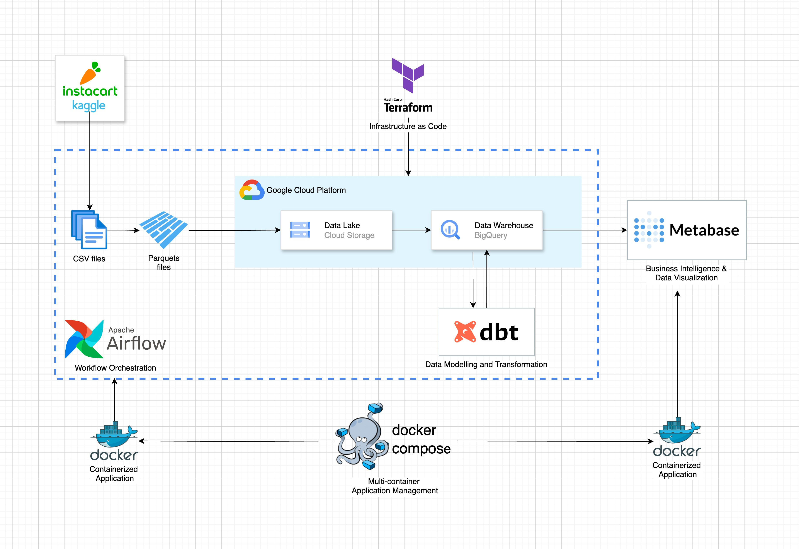
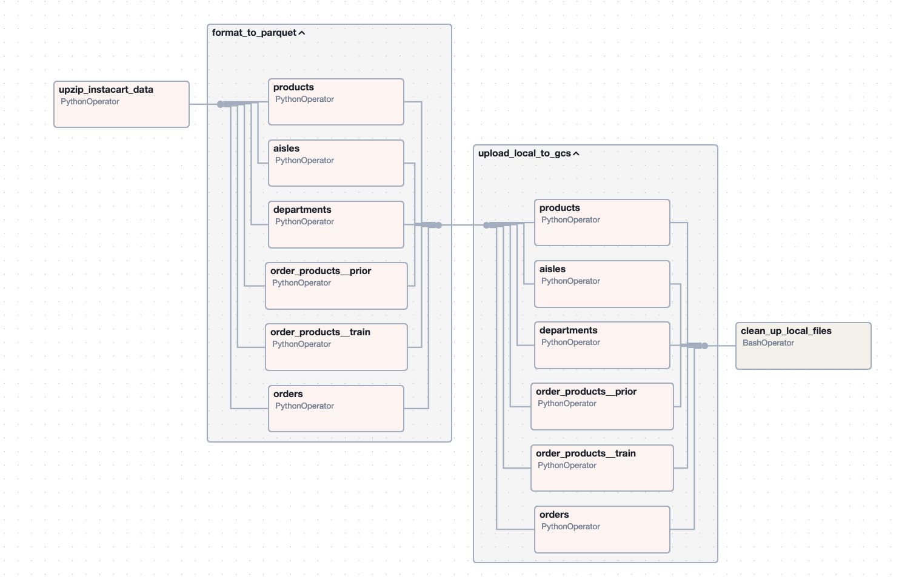
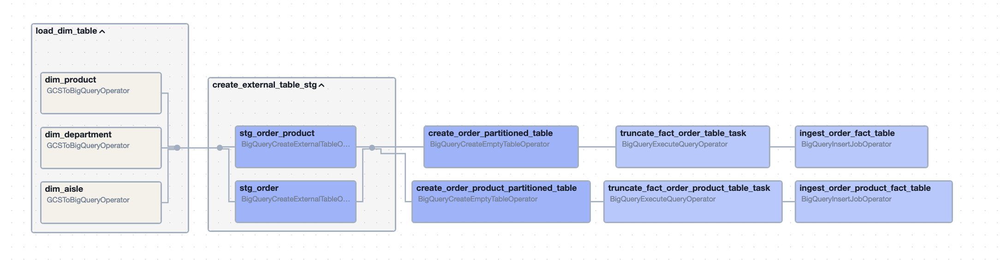
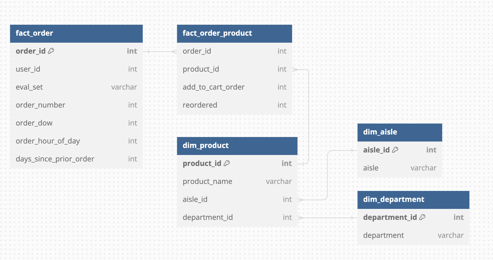
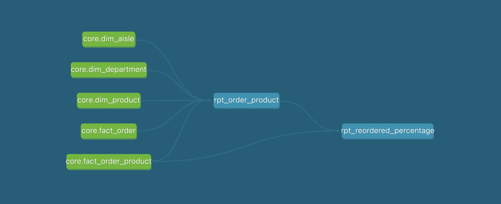
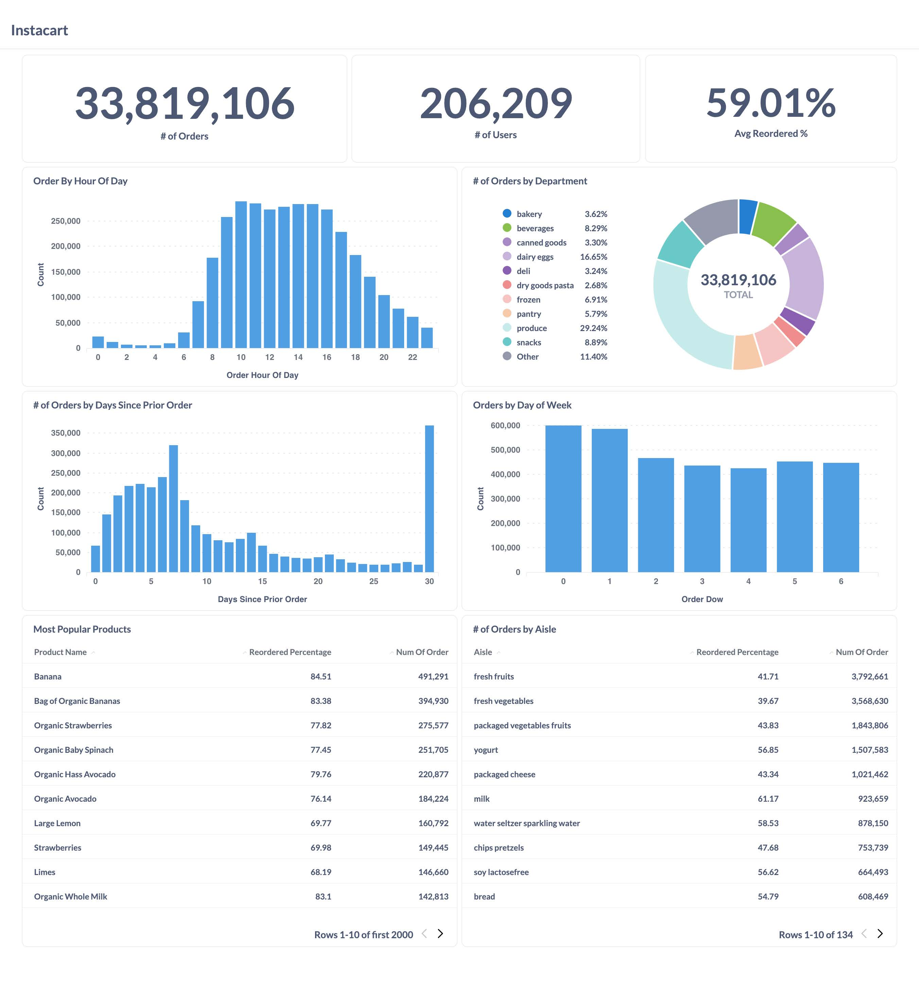

# Instacart Data Engineering Project

## Overview

This project is designed as a showcase of advanced data engineering practices, utilizing the Instacart dataset to demonstrate a sophisticated pipeline architecture. 

From the initial data ingestion phase to the final analysis, every step is engineered to ensure efficiency, scalability, and reliability. The pipeline employs modern data processing frameworks and techniques to clean, transform, and enrich the raw data, preparing it for insightful analysis. 

The end product is a versatile analytics dashboard that draws on this processed data, offering users the ability to uncover users' behavior as well as shopping trends and patterns with ease. This project not only aims to provide valuable insights from the Instacart dataset but also to serve as a blueprint for building robust data engineering pipelines.

## Pipeline Architecture

  

- **Google Cloud Platform (GCP)**: The foundational cloud infrastructure that ensures scalability and robust performance for hosting our Data Lake and Data Warehouse
- **Terraform**: Tool for Infrastructure as Code (IaC) which automates the provisioning and management of our cloud resources, establishing a consistent and scalable environment through code
- **Docker and Docker Compose**: Tools that containerizes components for consistent deployment across environments and simplifies multi-container application management
- **Apache Airflow**: Automated workflow managment tool that orchestrates data ingestion, processing, and transformation tasks
- **Apache Parquet**: Before being ingested to data lake, raw data is transformed into Apache Parquet to compress storage and accelerate query performance with its columnar format.
- **Google Cloud Storage**: Acts as the primary data lake, a scalable repository for storing vast amounts of raw and processed data
- **dbt**: Handles data transformation and modeling, turning raw data into structured, analysis-ready information within the Data Warehouse
- **BigQuery**: Acts as the data warehouse, providing a robust platform for storing and querying processed data, enabling complex data analysis
- **Metabase**: Offers interactive dashboards for data visualization and business intelligence, allowing users to derive insights from the processed data stored in BigQuery.

## Dataset

The Instacart dataset offers an expansive look into grocery shopping patterns through data compiled from over 3 million orders by more than 200,000 Instacart users. It presents detailed information on product purchases, the order in which items were added to the cart, user ordering history, and the timing of these orders. This dataset is useful for exploring consumer behaviors, product relationships, and shopping trends.

Key components of the dataset include:

- **Orders**: Detailed information about each order, including user ID, order number, order day of the week, and time of day.
- **Products**: Product names along with their corresponding product ID and aisle ID.
- **Aisles**: A listing of aisle categories, providing context for product placement and categorization.
- **Departments**: Department information that categorizes aisles into broader segments.
- **Order Products (Prior and Train)**: Data linking products to specific orders, indicating whether a product was reordered and the sequence in which products were added to the cart.
  
The dataset files and their schema definitions are available on Kaggle at [Instacart Market Basket Analysis](
https://www.kaggle.com/c/instacart-market-basket-analysis)

## Workflow

Our data processing and analysis workflows are orchestrated using Apache Airflow, organized into the following key DAGs:

- `s1_ingest_to_gcs`: Extracts raw data from zip files in CSV format, converts it to Parquet, and ingests it into Google Cloud Storage as our Data Lake.
- `s2_ingest_to_bigquery`: Moves data from the Data Lake to Google BigQuery, setting up tables with partitioning and clustering, and aligns them within a dimensional model.
- `s3_dbt_build`: Acts as the analytics engineering layer, where data models are built and data is transformed and aggregated into structured, analysis-ready formats for reporting and dashboard development.

  <h3 style="text-align: center">s1_ingest_to_gcs</h3>
  

  <h3 style="text-align: center">s2_ingest_to_bigquery</h3>
  

  <h3 style="text-align: center">s3_dbt_build</h3>
  

## Data Warehousing

Our data warehousing solution is built on Google BigQuery, serving as the infrastructure for our data storage and analysis needs. We employ dimensional modeling to structure our tables, optimizing for query performance and data organization.

  

### Partitioning and Clustering

The use of partitioning and clustering strategies is key to managing and querying our data efficiently. Below are details on how these techniques are applied to our main tables:

- fact_order: stores details of each order, including order_id, user_id, eval_set, order_number, order_dow (day of the week), order_hour_of_day, and days_since_prior_order.
  - Partitioned by user_id: This allows for efficient query performance when filtering data for specific users, making user-centric analyses faster and more manageable.
  - Clustered by order_id: Orders are sorted by order_id to facilitate chronological analysis of a user's orders, identifying the first and last orders easily.
- fact_order_product: stores information linking orders to products, with fields such as order_id, product_id, add_to_cart_order, and reordered.
  - Partitioned by order_id: Enables efficient filtering of data based on specific orders, essential for analyzing order-level product selections.
  - Clustered by add_to_cart_order: Sorts products within an order by their addition sequence to the cart, allowing for a sequential view of how products were chosen.

## Analytics Engineering with DBT

Our analytics engineering leverages DBT to refine and model our data within the BigQuery environment, paving the way for sophisticated analytics. DBT empowers us to transform raw data into meaningful insights by creating a series of models that evolve into our reporting layers.

### Core Models

- `core.dim_aisle`, `core.dim_department`, and `core.dim_product`: Dimension tables that structure the categorical data, providing context for analysis.
- `core.fact_order` and `core.fact_order_product`: Fact tables capturing transactional data, serving as the foundation for detailed analytics.

### Reporting Models

- `rpt_order_product`: Integrates data from various core models to provide comprehensive reporting on orders and associated products.
- `rpt_reordered_percentage`: A specialized report that calculates the reorder percentages, offering insights into customer repurchase behaviors and product retention.

By utilizing DBT to build these models, we ensure that data remains consistent, well-structured, and primed for both ad-hoc querying and the development of analytics dashboards. This structured approach facilitates efficient data usage across the organization, supporting informed decision-making and strategic business initiatives.

  

## Analytics Dashboard

We use Metabase for our analytics dashboard, providing users with an interactive interface to engage with the Instacart dataset. The dashboard visualizes key metrics such as total orders and user counts, average reorder rates, order distribution by time and department, and top products. It enables a quick understanding of user engagement, purchasing patterns, and product performance.

  

## Project Setup

To get started with our Instacart Data Engineering Project, follow these [this setup instructions](setup.md).